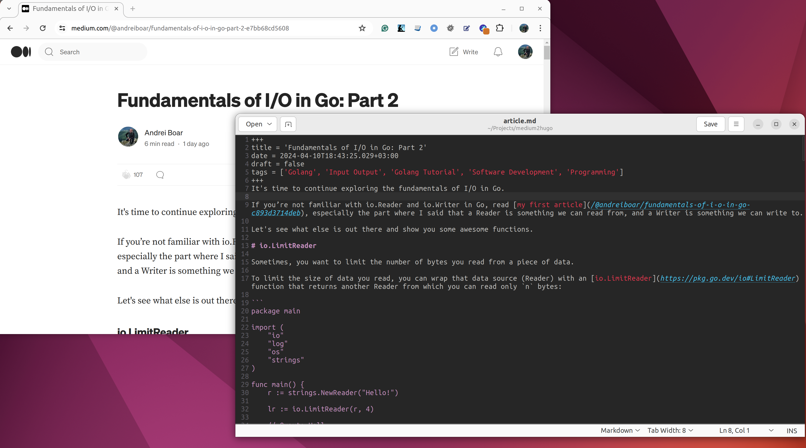

# medium2hugo

Export your Medium stories in Markdown syntax for [Hugo](https://gohugo.io/).

<p align="center">

</p>

## Installation

```shell
git clone git@github.com:zuzuleinen/medium2hugo.git
go install
```

## Usage

### Export single article

```bash
medium2hugo <url>
```

Example:

```bash
medium2hugo https://medium.com/@andreiboar/fundamentals-of-i-o-in-go-part-2-e7bb68cd5608
```

### Images

If the Medium story contains any images they are saved in a `./images` directory:

```shell 

$ medium2hugo https://medium.com/@andreiboar/fundamentals-of-i-o-in-go-part-2-e7bb68cd5608

Exporting image: images/1*-KZONqGNNwqPJ4Bmf70o-Q.png
Exporting image: images/1*M7AlXdGEfds9uD8fgkU6qw.png
Exporting image: images/1*WPw5kYw_1aq8d1qiVW0uRg.png
Exporting image: images/1*7HqA96t-RS1q7-c0B8k8PA.png
Exporting image: images/1*9EqehxF0ndL0YFlFVTqGqQ.jpeg
Exporting image: images/1*41tmv3iHYKLioseW8TgUJw.png

Article saved in: fundamentals-of-i-o-in-go-part-2-e7bb68cd5608.md
```

## Contributing

If you encounter a problem feel free to [open an issue](https://github.com/zuzuleinen/medium2hugo/issues/new) or e-mail
me at andrey.boar[at]gmail.com

If you want to keep in touch [connect with me on LinkedIn](https://www.linkedin.com/in/andrei-boar/)