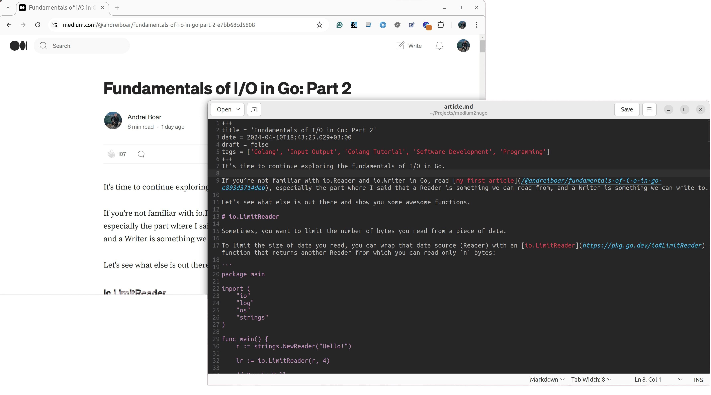

# medium2hugo

Export your Medium stories into Hugo Markdown syntax.

<p align="center">

</p>

## Installation

```shell
git clone git@github.com:zuzuleinen/medium2hugo.git
go install
```

## Usage

```bash
medium2hugo <url>
```

Example:

```bash
medium2hugo https://medium.com/@andreiboar/fundamentals-of-i-o-in-go-part-2-e7bb68cd5608
```
